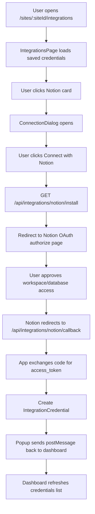
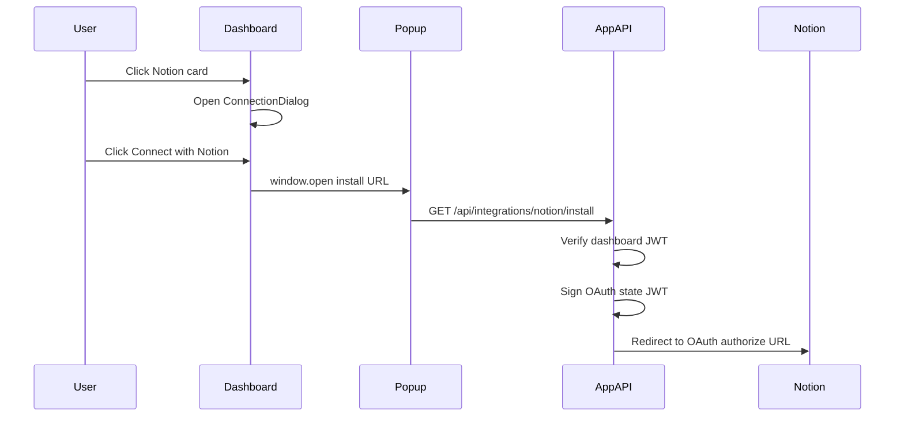
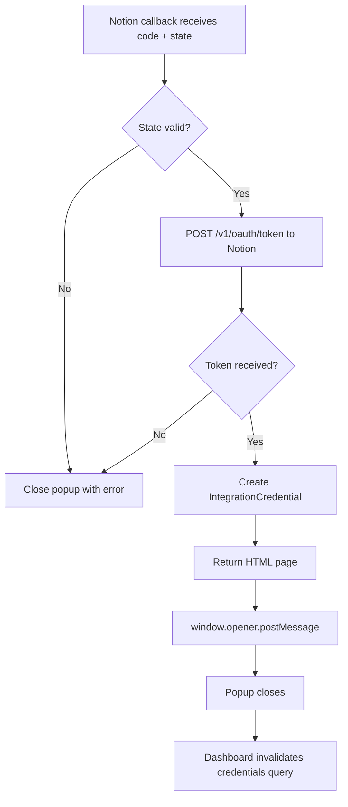
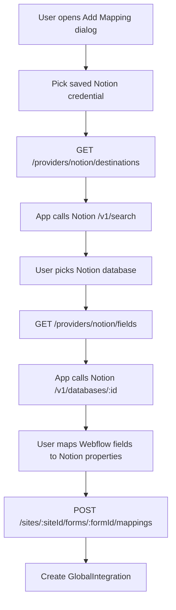
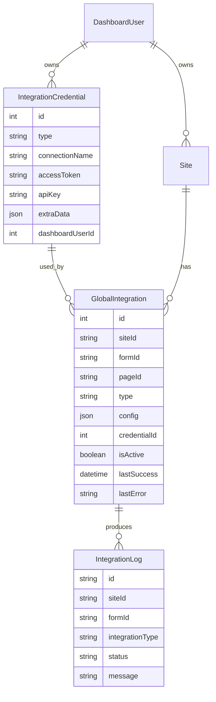
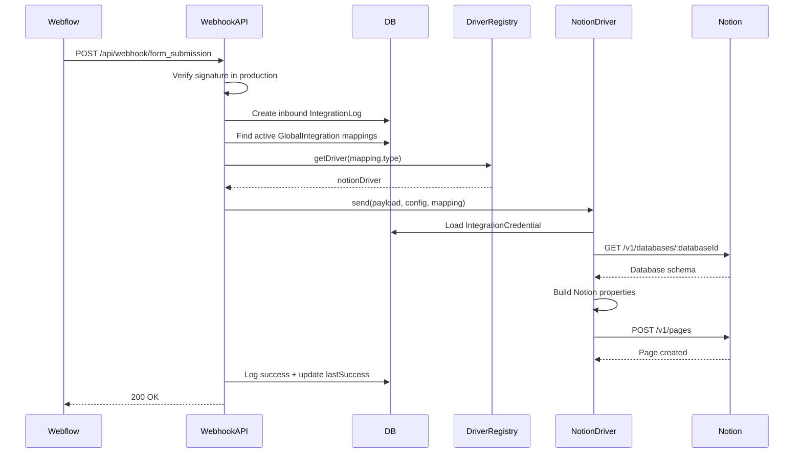

Here’s the foundation mental model for this app:

`IntegrationCredential` = “Can this user access Notion?”
`GlobalIntegration` = “Which Webflow form should send data to which Notion database, with which field mapping?”

The Integrations page creates the first one. The form mapping flow creates the second one. Webflow submissions use both to create Notion pages.

**Core Files**
- [Integrations page](C:/Users/User/OneDrive/Desktop/webflow-form-integration-app/apps/platform/src/app/(dashboard)/sites/[siteId]/integrations/page.tsx)
- [Connection dialog](C:/Users/User/OneDrive/Desktop/webflow-form-integration-app/apps/platform/src/features/integrations/connection-dialog.tsx)
- [Provider config](C:/Users/User/OneDrive/Desktop/webflow-form-integration-app/apps/platform/src/features/integrations/providers.ts)
- [Notion install route](C:/Users/User/OneDrive/Desktop/webflow-form-integration-app/apps/platform/src/app/api/integrations/notion/install/route.ts)
- [Notion callback route](C:/Users/User/OneDrive/Desktop/webflow-form-integration-app/apps/platform/src/app/api/integrations/notion/callback/route.ts)
- [Mapping dialog](C:/Users/User/OneDrive/Desktop/webflow-form-integration-app/apps/platform/src/features/integrations/add-mapping-dialog.tsx)
- [Webhook receiver](C:/Users/User/OneDrive/Desktop/webflow-form-integration-app/apps/platform/src/app/api/webhook/form_submission/route.ts)
- [Notion driver](C:/Users/User/OneDrive/Desktop/webflow-form-integration-app/apps/platform/src/lib/drivers/notionDriver.ts)
- [Prisma schema](C:/Users/User/OneDrive/Desktop/webflow-form-integration-app/apps/platform/prisma/schema.prisma)

**Big Picture**



**1. User Opens The Integration Page**

The user visits:

```txt
/sites/:siteId/integrations
```

The page fetches credentials with:

```ts
dashboardApi.credentials()
```

That maps to:

```txt
GET /api/dashboard/credentials
```

The API route reads the JWT from the `Authorization: Bearer ...` header and returns all `IntegrationCredential` rows owned by the logged-in dashboard user.

The Notion provider is defined here:

```ts
{
  slug: "notion",
  typeEnum: "NOTION",
  name: "Notion",
  authMode: "oauth",
  supportsApiKey: true,
  typeAliases: ["NOTIONCONNECTION"],
}
```

Important: OAuth Notion connections are stored as `NOTIONCONNECTION`, while manual API-key Notion connections are stored as `NOTION`. The app treats both as the same provider via `typeAliases`.

**2. User Clicks “Connect With Notion”**

In `ConnectionDialog`, this button builds an install URL:

```txt
/api/integrations/notion/install?token=<dashboard-jwt>&name=<connection-name>
```

It opens that URL in a popup window.

The popup is important because OAuth leaves your app, goes to Notion, then comes back. The main dashboard page stays open and waits for a browser `postMessage`.



**3. Install Route Creates The OAuth Redirect**

The install route does three major things:

```txt
GET /api/integrations/notion/install
```

1. Reads `token` and `name` from query params.
2. Verifies the dashboard JWT with `verifyToken`.
3. Creates a signed short-lived OAuth `state`.

The `state` contains:

```ts
{
  userId: auth.id,
  name,
  provider: "notion"
}
```

Then it redirects the popup to:

```txt
https://api.notion.com/v1/oauth/authorize
```

With params:

```txt
client_id
redirect_uri
response_type=code
owner=user
state=<signed-state>
```

That `state` is critical. It lets the callback route know which dashboard user started the connection, without trusting browser-provided user IDs.

**4. User Authorizes In Notion**

In Notion, the user chooses the workspace/pages/databases the app may access. If approved, Notion redirects back to the configured callback URL:

```txt
/api/integrations/notion/callback?code=...&state=...
```

The `code` is temporary. It is not the final token.

**5. Callback Route Exchanges Code For Token**

The callback route:

```txt
GET /api/integrations/notion/callback
```

does this:

1. Reads `code` and `state`.
2. Verifies the signed state using `verifyOauthState`.
3. Confirms `decoded.provider === "notion"`.
4. Calls Notion token endpoint:

```txt
POST https://api.notion.com/v1/oauth/token
```

With Basic Auth:

```txt
base64(NOTION_CLIENT_ID:NOTION_CLIENT_SECRET)
```

And body:

```json
{
  "grant_type": "authorization_code",
  "code": "...",
  "redirect_uri": "..."
}
```

If Notion returns `access_token`, the app stores it.



The created DB record looks like:

```ts
await db.integrationCredential.create({
  data: {
    siteId: "",
    type: "NOTIONCONNECTION",
    connectionName: decoded.name,
    accessToken: data.access_token,
    extraData: {
      botId: data.bot_id,
      workspaceId: data.workspace_id,
      workspaceName: data.workspace_name,
      owner: data.owner,
    },
    dashboardUserId: decoded.userId,
  },
});
```

So at this point, the app has successfully created the Notion connection.

But it has not yet connected any Webflow form to any Notion database. That happens next.

**6. Popup Tells The Dashboard It Worked**

The callback does not redirect the whole dashboard. Instead it returns a tiny HTML page using `closeOauthPopup`.

That page runs:

```js
window.opener.postMessage({
  source: "flowappz-oauth",
  provider: "notion",
  ok,
  message
}, "*");
```

The original `ConnectionDialog` listens for that message. When it receives `ok: true`, it:

```ts
toast.success(`${provider.name} connected.`);
qc.invalidateQueries({ queryKey: ["credentials"] });
```

This reloads the credentials list and the Notion card shows as connected.

**7. User Maps A Webflow Form To Notion**

This part happens from the site/form management page, not the Integrations page itself.

The mapping dialog lets the user pick:

1. A saved credential, for example “Notion integration”.
2. A Notion destination, meaning a Notion database.
3. Field mappings, for example `Email -> Email`, `Name -> Name`.

When the user selects a Notion credential, the app calls:

```txt
GET /api/dashboard/providers/notion/destinations?credentialId=123
```

That route finds the user-owned credential and calls Notion:

```txt
POST https://api.notion.com/v1/search
```

With:

```json
{
  "filter": {
    "property": "object",
    "value": "database"
  },
  "page_size": 100
}
```

The response becomes a list of selectable databases:

```ts
[
  { id: d.id, name: "Database name" }
]
```

Then, after the user picks a database, the app calls:

```txt
GET /api/dashboard/providers/notion/fields?destinationId=<databaseId>&credentialId=123
```

That route calls:

```txt
GET https://api.notion.com/v1/databases/:databaseId
```

It converts Notion database properties into field options:

```ts
{
  id: name,
  name,
  type,
  supported: NOTION_WRITABLE_TYPES.has(type)
}
```

Supported Notion field types include:

```txt
title
rich_text
number
select
multi_select
status
date
checkbox
email
phone_number
url
files
```

**Mapping Flow**



**8. Mapping Record Is Created**

When the user saves, the app calls:

```txt
POST /api/dashboard/sites/:siteId/forms/:formId/mappings
```

The payload includes:

```ts
{
  credentialId: 123,
  pageId,
  formElementId,
  type: "NOTIONCONNECTION",
  integrationName: "Notion -> Leads",
  config: {
    authMode: "oauth",
    credentialId: 123,
    destinationId: "<notion-database-id>",
    destinationLabel: "Leads",
    fieldMapping: [
      {
        webflowField: "Email",
        webflowFieldId: "...",
        providerField: "Email"
      }
    ]
  }
}
```

The API route checks:

1. User is authenticated.
2. Site belongs to user.
3. Site is licensed or dev bypass is enabled.
4. Credential belongs to user.
5. No existing mapping already exists for that same form.

Then it creates a `GlobalIntegration`.

That is the actual “send this Webflow form to this Notion database” record.

**Data Model**



**9. Webflow Sends A Form Submission**

When someone submits the Webflow form, Webflow sends a webhook to:

```txt
POST /api/webhook/form_submission
```

The app:

1. Reads the raw body.
2. In production, verifies the Webflow signature.
3. Parses the payload.
4. Extracts:
   - `formId`
   - `siteId`
   - `formElementId`
   - `data`
   - `schema`
   - idempotency hint
5. Logs the inbound webhook.
6. Finds active mappings from `GlobalIntegration`.

It first searches by `formId`:

```ts
where: { formId, isActive: true }
```

If none are found, it falls back to:

```ts
where: { siteId, formElementId, isActive: true }
```

That fallback helps when a Webflow component form appears on multiple pages.

**10. Driver Registry Chooses The Notion Driver**

The webhook route calls:

```ts
const driver = getDriver(m.type);
```

The registry supports both Notion enum values:

```ts
const registry = {
  NOTION: notionDriver,
  NOTIONCONNECTION: notionDriver,
};
```

So whether the connection came from OAuth or manual API key, the same Notion driver handles delivery.

**11. Notion Driver Creates The Page**

The Notion driver receives:

```ts
driver.send(
  mapping.id,
  "form_submission",
  mapping.formId,
  submittedData,
  normalizedConfig,
  mapping
)
```

Then it:

1. Loads the `IntegrationCredential`.
2. Gets the Notion database ID from mapping config.
3. Gets token from `credential.accessToken ?? credential.apiKey`.
4. Fetches Notion database schema.
5. Converts Webflow payload into Notion `properties`.
6. Calls Notion:

```txt
POST https://api.notion.com/v1/pages
```

With:

```json
{
  "parent": {
    "database_id": "<database-id>"
  },
  "properties": {
    "Email": {
      "email": "person@example.com"
    },
    "Name": {
      "title": [
        {
          "type": "text",
          "text": {
            "content": "Ada Lovelace"
          }
        }
      ]
    }
  }
}
```

The driver also handles Notion property types differently. For example:

```txt
title       -> { title: [...] }
rich_text   -> { rich_text: [...] }
number      -> { number: Number(value) }
select      -> { select: { name: value } }
checkbox    -> { checkbox: true/false }
email       -> { email: value }
date        -> { date: { start: ISODate } }
files       -> { files: [...] }
```

**Runtime Delivery Flow**



**The Reusable Pattern For Future Providers**

For any new third-party provider, copy this architecture:

1. Add provider metadata in `providers.ts`.
2. Add credential creation:
   - OAuth providers need `/install` and `/callback`.
   - API-key providers can use `POST /dashboard/credentials`.
3. Store reusable auth in `IntegrationCredential`.
4. Add destination discovery route logic.
5. Add field discovery route logic.
6. Save form-specific config in `GlobalIntegration`.
7. Add a provider driver.
8. Register the driver in `drivers/index.ts`.
9. Let `/api/webhook/form_submission` dispatch to it.

The clean abstraction is:

```txt
Credential = who can access provider
Destination = where inside provider to send data
Field mapping = how Webflow payload maps to provider fields
Driver = how to perform the final API write
Log = what happened
```

For Notion specifically, the successful end-to-end chain is:

```txt
User connects Notion
-> app stores access token as IntegrationCredential
-> user chooses Notion database
-> app stores database + field mapping as GlobalIntegration
-> Webflow sends submission webhook
-> app loads mapping + credential
-> notionDriver creates a page in the selected Notion database
-> app logs success or failure
```